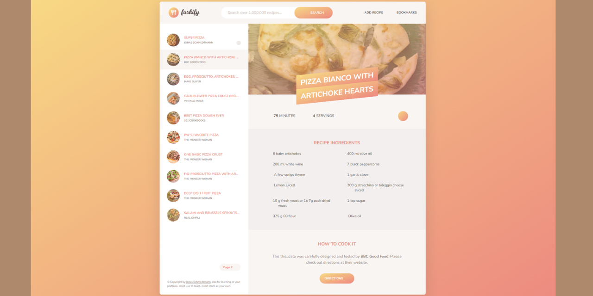

# forkify Project

Recipe application with custom recipe uploads.

### javascript-course-bankist2

# 🍴 "Forkify" - a recipe application

## Table of contents

- [Project Title](#🍴-"forkify"-a-recipe-application)
- [Overview](#overview)
- [The Project](#the-project)
- [Technology stack](#technology-stack)
- [Links](#links)
- [Visuals](#visuals)
- [Project Status](#project-status)
- [Author](#author)

## Overview

### The Project

The project from 'The Complete JavaScript Course 2025: From Zero to Expert!' on Udemy by Jonas Schmedtmann.
Recipe application with custom recipe uploads. "Forkify" is all about searching for recipes and displaying them in the user interface.

### Technology stack

- HTML
- CSS
- JavaScript

### Links

- Source code repository URL: [Github](https://github.com/basiacarvalho/javascript-course-forkify)
- Live Site URL: [Live demo](https://forkify-barbara-carvalho.netlify.app/)

### Visuals

#### Tablet and Desktop view :

### Project Status

- Completed (with the possiblity for future adaption)\
  The basic concepts of the project have been met, however further ideas may be implemented and added in the future.

### Author

👩‍💻 The "Forkify" app is the result of taking part in a course on Udemy: 'The Complete JavaScript Course 2025: From Zero to Expert!' by Jonas Schmedtmann. The code comes from the course content (The "README.md" file was created by me).

